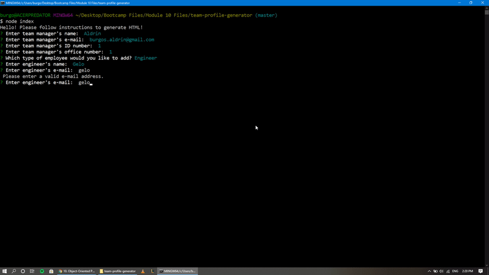

# Team Profile Generator

## Description

A Node.js command-line application that takes in information about employees on a software engineering team and generates an HTML webpage that displays summaries for each person.

**Link to deployed application:** [https://github.com/aldrinburgos18/team-profile-generator](https://github.com/aldrinburgos18/team-profile-generator)

## Table of Contents

- [Installation](#installation)
- [Usage](#usage)
- [Contributing](#contributing)
- [Questions](#questions)
- [License](#license)

## Installation

Open terminal, install dependencies using the command 'npm_install', then run index.js using node.

## Usage

Start the program by typing "node index" in the terminal

Follow on screen prompt to generate values for HTML.  

Menu to add another employee:

The program checks for input errors:

## Screenshots

The generated HTML will look like this:

## Contributing

When contributing to this repository, please first discuss the change you wish to make via issue, email, or any other method with the owners of this repository before making a change.

## Questions

If you have any additional questions, please feel free to contact me at:  
E-mail: burgos.aldrin@gmail.com  
Github: [aldrinburgos18](https://github.com/aldrinburgos18)

## License

  
A short and simple permissive license with conditions only requiring preservation of copyright and license notices. Licensed works, modifications, and larger works may be distributed under different terms and without source code.  
_[More Information about this license...](https://opensource.org/licenses/MIT)_
